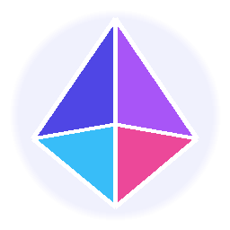

# 💎 PrismStrap

<div align="center">



### 次世代 Roblox ブートストラッパー & 最適化ツール
**FPS上限完全解放・歴代アプリアイコン・クラシックOOF音・FastFlagsワークショップを手のひらに。**

[-blue.svg)](https://prismstrap.vercel.app/)
[](https://dotnet.microsoft.com/)
[](LICENSE)
[](https://prismstrap.vercel.app/)

[**公式サイトを見る (Web)**](https://prismstrap.vercel.app/) • [**ダウンロード**](https://prismstrap.vercel.app/#download) • [**機能一覧**](#-主な機能)

</div>

---

## 📖 PrismStrap とは？

**PrismStrap** は、Robloxのプレイ体験を極限まで引き上げるために設計された、軽量・高機能なオープンソース・ブートストラッパーです。

公式クライアントの制限（60FPS固定、死亡音の強制変更など）を打ち破り、滑らかなゲームプレイと高度なカスタマイズ性を提供します。日本語に完全対応し、初心者でも直感的に使えるモダンな UI（Fluent Design）を採用しています。

---

## ✨ 主な機能

### 🚀 1. FPS上限の完全解放 (FPS Unlocker)
- 60FPSの壁を突破し、**144FPS / 240FPS / 無制限** で圧倒的にヌルヌルな操作感を実現。
- DirectX / Vulkan のレンダリング最適化により、低スペックPCでも遅延とラグを最小化。

### 💀 2. サウンドカスタマイズ (Sound Mods)
- 伝説の **『クラシック OOF 音 (2006)』** をワンクリックで復活！
- 海外ミームで人気の **『Vine Boom 音』** や、お好みの自作音声（`.mp3` / `.ogg`）にも自由に変更可能。

### 🎨 3. 歴代公式アプリアイコン着せ替え
- ショートカットや起動アイコンを、懐かしの歴代Robloxアイコンに瞬時に変更：
  - **2008**: 伝説のクラシック赤Rアイコン
  - **2017**: チルトレッド正方形「O」アイコン
  - **2022**: 洗練されたモダンシルバーアイコン
  - **PrismStrap**: 鮮やかなプリズムオリジナルアイコン

### 🌐 4. FastFlags ワークショップ
- 世界中のプレイヤーが作成した最適化プリセットを、1クリックで即時適用。
- ライティング向上、影の描画距離調整、テクスチャ品質コントロールなど、Robloxの内部エンジンパラメータを自由にコントロール。

### 🖱️ 5. カーソル & フォント変更
- レトロな矢印カーソルや、お好みのフォント（Comic Sans等）への変更に対応。

---

## 📥 インストール & 使い方

### 必要要件
- **OS**: Windows 10 / 11 (64-bit)
- **Roblox**: 公式Roblox Playerがインストールされていること

### 導入手順
1. [公式サイト (prismstrap.vercel.app)](https://prismstrap.vercel.app/) からインストーラー（`Setup.exe`）またはポータブル版をダウンロードします。
2. `Setup.exe` を起動してインストールします。
3. PrismStrap を起動し、好みの設定（FPS上限、サウンド、アイコンなど）を選択するだけで完了です！

---

## 🛠️ 開発者向け (ビルド方法)

PrismStrap は C# / .NET 8 (WPF) で構築されています。

### 前提条件
- [.NET 8.0 SDK](https://dotnet.microsoft.com/download/dotnet/8.0)
- Visual Studio 2022 (または VS Code + C# Dev Kit)

### クローン & ビルド
```bash
# リポジトリのクローン
git clone https://github.com/ryusan5300-gif/PrismStrap.git
cd PrismStrap

# 依存パッケージの復元とビルド
dotnet restore
dotnet build -c Release
```

---

## 🤝 コミュニティ & 貢献

バグ報告や新機能のリクエストは [GitHub Issues](https://github.com/ryusan5300-gif/PrismStrap/issues) までお気軽にお寄せください！Pull Request も大歓迎です。

---

## 📄 ライセンス

本プロジェクトは [MIT License](LICENSE) のもとで公開されています。

---

<div align="center">
Made with ❤️ for Roblox Players everywhere.
</div>
